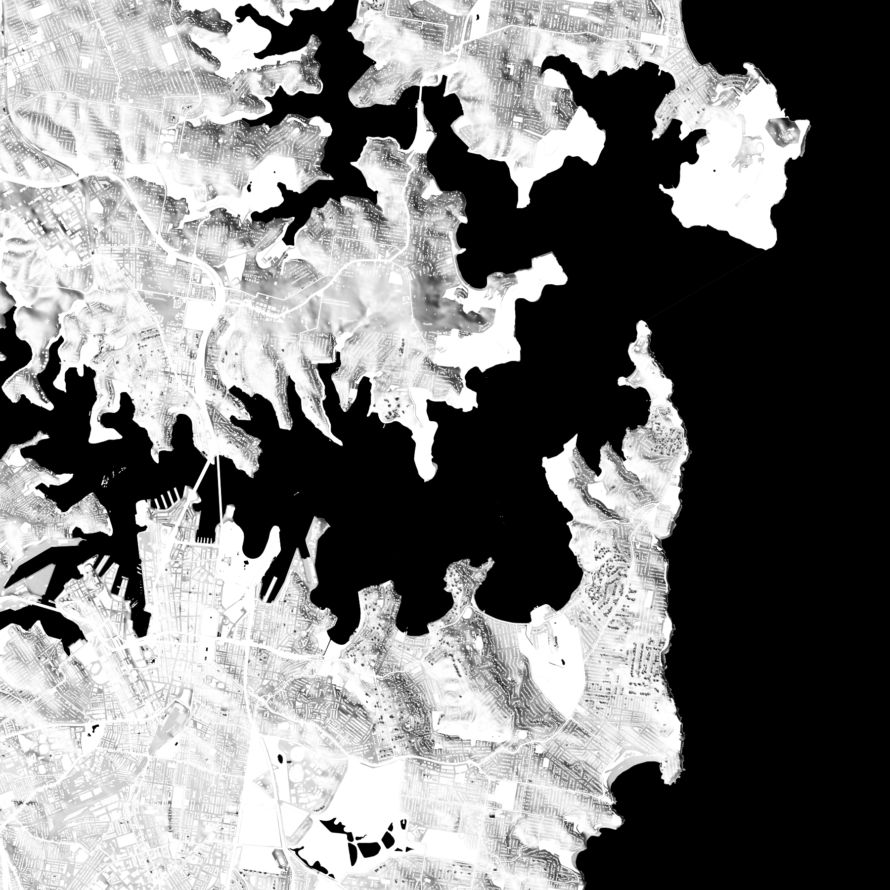

# bondimap — 3D-printable city relief from Overture + Mapterhorn

Generates a tiled, multi-colour `.3mf` wall-art relief map (Bondi / Sydney by
default) sized for a Bambu Lab X1E (256 mm plate). Detail comes from
[Overture Maps](https://overturemaps.org) (buildings, roads, water, parks),
elevation from [Mapterhorn](https://mapterhorn.com) terrain tiles with an AWS
Mapzen fallback. It does the heavy lifting locally and streams only the data it
needs, so it doesn't hit the out-of-memory wall that the browser tool does.

Each map category is exported as a **separate, pre-coloured object** in the
`.3mf`, so in Bambu Studio you just assign an AMS filament per object.



*Hillshaded top-down preview (auto-generated alongside the `.3mf`). Default
scheme is the black-water / matte-white-relief look above — water and frame
black, land/buildings/parks/streets white, with 4× vertical exaggeration so the
topography carries the detail. All of this is just `colors` and
`vertical_exaggeration` in `config.json`.*

## Setup

```bash
conda env create -f environment.yml
conda activate bondimap
```

## Use

1. Edit `config.json` — at minimum `area.center_lat` / `center_lon` / `span_m`
   (or set `area.bbox` to `[west, south, east, north]`). Tweak `colors` to taste.
2. Generate:
   ```bash
   python run.py config.json
   ```
3. Output: `output/bondi_r0c0.3mf … r1c1.3mf` (one per tile).

A tiny, fast smoke-test config is included: `python run.py test_config.json`.

### Interactive 3D viewer (HTML)

```bash
python make_viewer.py output/bondi_r0c0.3mf config.json
```

Writes a self-contained `output/bondi_r0c0.html` — double-click to orbit the
model in any browser (Three.js loads from a CDN; the geometry is embedded as a
base64 GLB, so no server or local-file fetch is needed). The terrain is
decimated to keep the file reasonable; colours follow `config.json`.

### Placing landmarks interactively

```bash
python make_placer.py            # writes output/placer.html
```

Open it, **click a landmark** to select, switch **Move / Rotate / Scale** (W/E/R),
drag the gizmo to position it on the map, and the panel shows a live, config-ready
`landmarks.items` JSON (lat / lon / size_mm / rotation_deg). Copy that into
`config.json`, set `landmarks.enabled: true`, and rerun `run.py`. (Reuses the
viewer's map GLB, so it builds in seconds.)

### Landmarks

The `landmarks` block places real models (or procedural fallbacks) at their
coordinates, scaled so the longest horizontal extent = `size_mm` (oversized so
they read on the map — at true scale the Opera House is only ~7 mm). Each item:

- `"type": "file"` — load an STL/3MF (`up` = which model axis points up; the
  loader re-orients to Z-up and aligns the long axis to +X).
- `"type": "opera_house"` / `"harbour_bridge"` — built-in procedural icons.
- Position with `lat`/`lon` (+ `rotation_deg`), or span a bridge between
  `end_a`/`end_b` `[lat, lon]` (auto-oriented along the bearing).

Defaults: the **bridge** uses the supplied assembled `habourbridge.stl`; the
**Opera House** uses the built-in procedural sails (the supplied
`operahouse.stl` was a giant-podium / tiny-sails model that read as a featureless
block at map scale, so the procedural icon is clearer — swap back via
`{"type": "file", "file": "operahouse.stl", ...}` if preferred). Both sit on the
terrain / water and export as a `landmarks` object you can colour or
filament-assign independently. (The original `harbourbridge.3mf` was a flat
print-kit layout of 11 unassembled parts, hence the re-uploaded STL.)

## What it produces

- **Size**: `model.size_mm` across (default 500 mm), split into
  `tiling.rows × tiling.cols` tiles (default 2×2 → four 250 mm tiles that fit the
  256 mm plate). The black **frame** is added only on the outer edges of the
  assembled piece; interior tile edges are flush butt joints.
- **Six objects per tile**: `terrain` (grey relief base, ≥ `base_thickness_mm`
  thick), `water` (flat sea), `trees` (parks/forest/grass), `buildings`
  (extruded), `streets`, `frame`.
- Elevation is exaggerated `vertical_exaggeration`× (default 3) and Gaussian-
  smoothed; building heights use `building_height_scale`×.

## Printing workflow (Bambu Studio / OrcaSlicer)

1. Import all tile `.3mf` files (drag in one at a time; each tile prints
   separately on the 256 mm plate).
2. Each tile shows 6 objects with the colours from `config.json`. Assign an AMS
   filament slot to each colour (Objects/Filament panel). The geometry already
   carries the colours, so this is a one-click-per-object mapping.
3. Slice and print each tile. Suggested: 0.2 mm layers, 0.4 mm nozzle.
4. **Assemble**: butt the four tiles together. For wall mounting, glue the
   assembled piece to a 500 mm backing board (plywood/3 mm acrylic) and hang the
   board with a French cleat — cleanest for a tiled art piece and spreads the
   load. (Per-tile hanging hardware would show seams under stress.)

## Tuning detail

The single biggest lever is **`area.span_m` vs `model.size_mm`** — that ratio is
the scale. Default 8000 m over 500 mm ≈ 1 mm per 16 m of ground.

- **More building detail** → smaller `span_m` (e.g. 5000) or larger `size_mm`.
- **Keep more streets** → lower `features.min_feature_mm` toward 0.4 (true
  nozzle width; thin roads get fragile), or raise per-class widths in
  `features.roads.class_width_m`. By default, streets whose scaled width is
  below `min_feature_mm` (≈ residential roads at 8 km) are dropped — this is the
  "buildings only, drop tiny streets" choice.
- **Finer terrain relief** → `elevation.zoom` 14 (≈ 4 m/px here). 13 is plenty
  for a city; Sydney is not mountainous and buildings carry the visual detail.
- **Smoother / rougher terrain** → `model.terrain_smoothing_sigma_px`.
- **Heavier/lighter mesh** → `model.terrain_grid_per_side` (1500 default; raise
  for crisper coastlines, lower for smaller files).

## Notes

- **Why 3MF, not STEP**: STEP is a B-rep CAD format. A multi-million-triangle
  city mesh has no clean B-rep representation — it would be a faceted shell with
  no native colour and a huge file. 3MF is the correct, colour-aware,
  slicer-native format for this. (If you ever truly need STEP, the meshes are
  plain `trimesh` objects and can be re-exported, but it isn't recommended.)
- **Overture data quirks**: occasional missing building heights (a
  `default_height_m` is applied) or footprint glitches. Water polygons may not
  extend to the very edge of open ocean; the grey datum base shows through there.
- **Attribution**: Overture Maps (ODbL/CDLA per layer); Mapterhorn terrain
  (see https://mapterhorn.com/attribution). Fine for personal art; check terms
  before redistribution.

## Layout

```
config.json          # edit this
run.py               # python run.py config.json
bondimap/
  config.py          # coords -> UTM, bbox, mm-per-metre scale
  elevation.py       # terrarium tiles -> smoothed height field
  overture.py        # DuckDB -> buildings/roads/water/green (model mm)
  mesh.py            # terrain solid, building extrusions, draped slabs, frame
  export.py          # multi-object coloured .3mf writer
  build.py           # orchestration + tiling
```
